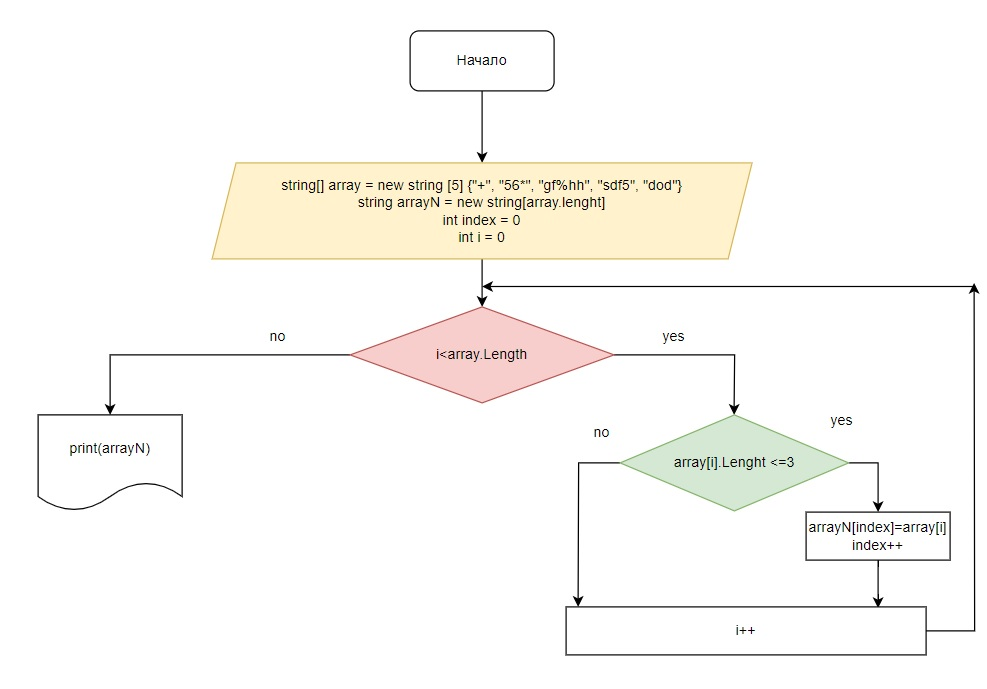

# ИТОГОВАЯ КОНТРОЛЬНАЯ РАБОТА ПО ОСНОВНОМУ БЛОКУ
## Задача 
```Sh
Написать программу, которая из имеющегося массива строк формирует новый массиы из строк, длина которых меньше, либо равна 3 символам. Первоначальный массив можно ввести с клавиатуры, либо задать на старте выполнения алгоритма. При решении не рекомендуется пользоваться коллекциями, лучше обойтись исключительно массивами.
```
## Алгоритм
* Задаем массив, заполненный строками.

* Создаем массив в который будет выгружаться результат работы программы. Длина нового массива равна длине исходного массива.

* Создаем цикл обращения к каждому из элементов массива.

* Проверяем является ли длина элемента массива меньше или равна трем.

* В случае если длина элемента массива меньше или равна трем данный элемент записывается в новый массив.

* Программа выводит на печать содержимое нового массива после завершения цикла.

## Блок-схема к алгоритму

